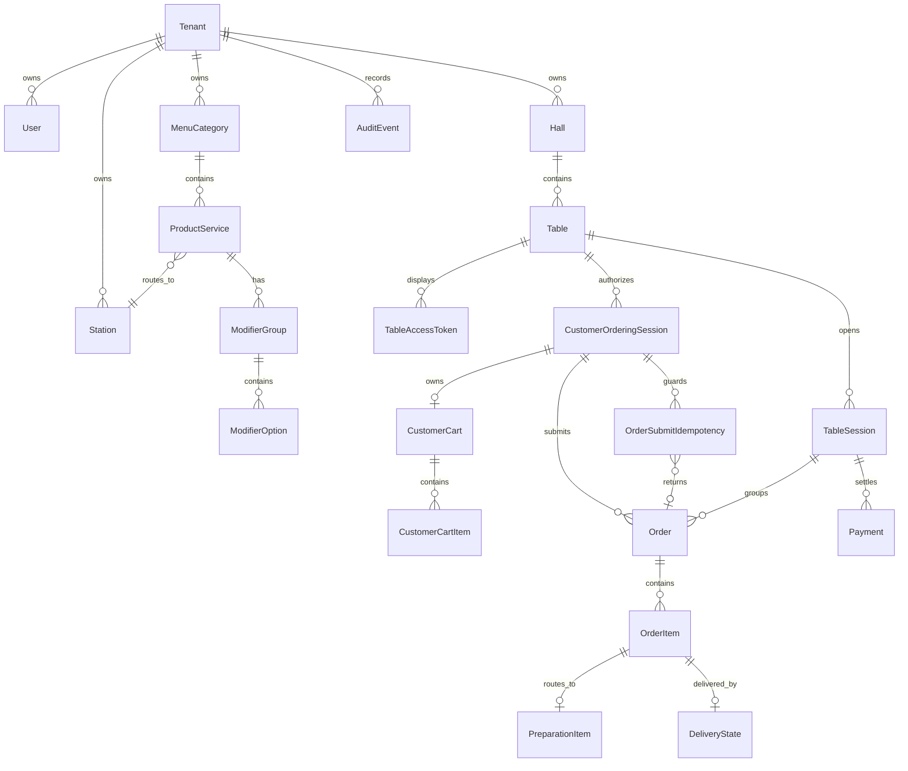

# Data Model

This document defines the initial domain data model for IoTables.

It is not a final database schema. It is the shared domain contract that database migrations, API contracts, and module implementations must follow.

## Principles

- Every tenant-scoped record must carry `tenantId` unless it is globally platform-owned.
- IDs should be opaque UUIDs unless a different identifier is explicitly justified.
- Human-readable names are not trusted identifiers.
- Frontend-provided prices, totals, table session IDs, station IDs, and permission scopes are never authoritative.
- Critical invariants must be enforced in the backend and the database.
- Runtime records should be soft-disabled or lifecycle-transitioned when history exists; avoid destructive deletion of business history.

## High-Level ERD

## Platform and Tenant

### Tenant

Owned by: Platform / Tenant Registry

| Field | Notes |
| --- | --- |
| `id` | Opaque tenant ID |
| `name` | Required, immutable |
| `subdomain` | Required, immutable, unique |
| `gsmNumber` | Required, editable, audited |
| `sector` | Editable classification; does not re-run starter data |
| `capacity` | Optional, editable |
| `address` | Optional, editable |
| `status` | Tenant lifecycle state |
| `createdAt`, `updatedAt` | Timestamps |

Invariants:

- `subdomain` is unique.
- `name` and `subdomain` cannot change after creation.
- changing `sector` after creation must not apply starter data again.
- suspended tenants cannot perform runtime operations.

### StarterTemplateApplication

Owned by: Sector Starter Templates

| Field | Notes |
| --- | --- |
| `tenantId` | Tenant receiving starter data |
| `sector` | Example: `cafe` |
| `templateVersion` | Versioned starter template |
| `appliedAt` | Completion timestamp |
| `status` | applied / failed / recovery-needed |

Constraints:

- unique by `tenantId + templateVersion`.
- must never run on restart, deployment, migration, or release upgrade.

## Identity, Staff, and Access

### User

Owned by: Identity and Access

| Field | Notes |
| --- | --- |
| `id` | Opaque user ID |
| `tenantId` | Nullable only for platform owner |
| `username` | Unique within tenant or platform scope |
| `status` | active / disabled |
| `firstPasswordChangeRequired` | Bootstrap flag |
| `createdAt`, `updatedAt` | Timestamps |

Starter usernames:

| Role | Username | OTP |
| --- | --- | --- |
| Tenant Admin | tenant subdomain | Required |
| Cashier | `kasiyer` | Required, sent to tenant GSM |
| Cook | `asci` | Not required |
| Barista | `barista` | Not required |
| Waiter | `garson` | Not required |
| Busser | `komi` | Not required |

### Credential

Owned by: Identity and Access

| Field | Notes |
| --- | --- |
| `userId` | User |
| `passwordHash` | Never store plaintext |
| `bootstrapCredential` | True until first password setup |
| `changedAt` | Last password change |

Invariants:

- bootstrap password cannot continue after first login.
- passwords and OTP values must never be logged.

### StaffProfile

Owned by: Staff Access

| Field | Notes |
| --- | --- |
| `tenantId` | Tenant |
| `userId` | Identity user |
| `displayName` | Staff label |
| `status` | active / disabled |

### StaffRoleAssignment

Owned by: Staff Access

| Field | Notes |
| --- | --- |
| `tenantId` | Tenant |
| `userId` | User |
| `role` | tenant_admin / cashier / station_staff / service_staff |

### StaffStationAssignment

Owned by: Staff Access

| Field | Notes |
| --- | --- |
| `tenantId` | Tenant |
| `userId` | Station staff |
| `stationId` | Authorized station |

### StaffHallAssignment

Owned by: Staff Access

| Field | Notes |
| --- | --- |
| `tenantId` | Tenant |
| `userId` | Service staff |
| `hallId` | Authorized hall |

## Venue Layout

### Hall

Owned by: Venue Layout

| Field | Notes |
| --- | --- |
| `tenantId` | Tenant |
| `id` | Hall ID |
| `name` | Human-readable name |
| `displayOrder` | UI order |
| `enabled` | Disabled halls do not accept active use |

### Table

Owned by: Venue Layout

| Field | Notes |
| --- | --- |
| `tenantId` | Tenant |
| `id` | Table ID |
| `hallId` | Parent hall |
| `name` | Human-readable table label |
| `position` | Optional layout metadata |
| `enabled` | Disabled tables cannot accept new orders |

Invariants:

- tables belong to exactly one hall.
- tables are managed inside Hall Management in TenantApp.
- historical table records should not be hard-deleted when sessions/orders exist.

## Stations and Menu

### Station

Owned by: Tenant setup / Staff Access boundary; used by Menu Catalog and Preparation

| Field | Notes |
| --- | --- |
| `tenantId` | Tenant |
| `id` | Station ID |
| `name` | Example: Mutfak, Kahve |
| `enabled` | Disabled stations cannot receive new items |

### MenuCategory

Owned by: Menu Catalog

| Field | Notes |
| --- | --- |
| `tenantId` | Tenant |
| `id` | Category ID |
| `name` | Customer-visible category |
| `displayOrder` | UI order |
| `enabled` | Controls visibility/orderability |

### ProductService

Owned by: Menu Catalog

| Field | Notes |
| --- | --- |
| `tenantId` | Tenant |
| `id` | Product/service ID |
| `categoryId` | Menu category |
| `stationId` | Fulfillment station |
| `name` | Customer-visible name |
| `description` | Optional |
| `imageRef` | Optional |
| `basePrice` | Current price authority |
| `available` | Orderability flag |
| `enabled` | Historical disable flag |

Invariants:

- current price changes do not alter existing OrderItem snapshots.
- unavailable or disabled products cannot be ordered.
- availability is rechecked during order submission.

### ModifierGroup

Owned by: Menu Catalog

| Field | Notes |
| --- | --- |
| `productServiceId` | Parent product |
| `name` | Example: Size, Milk Type |
| `required` | Whether customer must select |
| `minSelections`, `maxSelections` | Selection constraints |

### ModifierOption

Owned by: Menu Catalog

| Field | Notes |
| --- | --- |
| `modifierGroupId` | Parent group |
| `name` | Customer-visible option |
| `priceDelta` | Price effect |
| `available` | Orderability |

## Table Access and Customer Session

### TableAccessToken

Owned by: Table Access / QR

| Field | Notes |
| --- | --- |
| `tenantId` | Tenant |
| `tableId` | Table |
| `tokenHash` | Store hash, not raw token |
| `expiresAt` | 60 seconds in v1 |
| `consumedAt` | Set atomically |

Invariants:

- token is one-time use.
- token redemption is atomic.
- token must not expose trusted table IDs directly.

### CustomerOrderingSession

Owned by: Customer Ordering

| Field | Notes |
| --- | --- |
| `tenantId` | Tenant |
| `id` | Session ID |
| `tableId` | Table context |
| `tableSessionId` | Current joined TableSession, nullable |
| `cookieTokenHash` | Opaque browser session token hash |
| `presenceValidUntil` | Fresh table presence window |
| `expiresAt` | 30 minutes in v1 |
| `lastSeenAt` | Activity |

Invariants:

- not created per order.
- may contain multiple orders.
- fresh QR refreshes existing compatible session when possible.
- cart belongs here, not to TableSession.

### CustomerCart

Owned by: Customer Ordering

| Field | Notes |
| --- | --- |
| `tenantId` | Tenant |
| `customerOrderingSessionId` | Cart owner |
| `status` | active / submitted / abandoned |
| `createdAt`, `updatedAt` | Timestamps |

Invariants:

- cart is not billable.
- one active cart exists per CustomerOrderingSession in v1.
- successful order submission clears or closes only the submitted cart.
- failed order submission preserves the cart for correction or retry.

### CustomerCartItem

Owned by: Customer Ordering

| Field | Notes |
| --- | --- |
| `cartId` | Cart owner |
| `clientCartItemId` | Client-generated stable item ID |
| `productServiceId` | Product |
| `quantity` | Quantity |
| `selectedModifiers` | Modifier option selections |
| `note` | Customer note |
| `estimatedPrice` | Client-visible only, not trusted |

## Orders, Preparation, and Delivery

### TableSession

Owned by: Table Session and Billing

| Field | Notes |
| --- | --- |
| `tenantId` | Tenant |
| `id` | Session ID |
| `tableId` | Table |
| `status` | open / closed |
| `openedAt`, `closedAt` | Lifecycle timestamps |

Constraints:

- only one active TableSession per `tenantId + tableId`.
- closed sessions cannot accept new orders/payments except explicit recovery.

### Order

Owned by: Customer Ordering

| Field | Notes |
| --- | --- |
| `tenantId` | Tenant |
| `id` | Order ID |
| `customerOrderingSessionId` | My Orders ownership |
| `tableSessionId` | Table bill/session ownership |
| `submittedAt` | Order time |
| `status` | Submitted/operational aggregate status if needed |

### OrderSubmitIdempotency

Owned by: Customer Ordering

| Field | Notes |
| --- | --- |
| `tenantId` | Tenant |
| `customerOrderingSessionId` | Session that submitted |
| `idempotencyKey` | Request key |
| `requestHash` | Optional normalized request fingerprint |
| `orderId` | Created order, nullable while processing |
| `status` | processing / completed / failed |
| `createdAt`, `completedAt` | Timestamps |

Invariants:

- unique by `tenantId + customerOrderingSessionId + idempotencyKey`.
- duplicate submit with the same key returns the original order result.
- same key with a materially different request must fail closed.

### OrderItem

Owned by: Customer Ordering

| Field | Notes |
| --- | --- |
| `tenantId` | Tenant |
| `id` | Order item ID |
| `orderId` | Parent order |
| `productServiceId` | Source product |
| `stationId` | Routing snapshot |
| `nameSnapshot` | Product name at order time |
| `unitPriceSnapshot` | Server-calculated price |
| `modifierSnapshot` | Selected modifiers and price deltas |
| `quantity` | Quantity |
| `note` | Customer note |

### PreparationItem

Owned by: Preparation

| Field | Notes |
| --- | --- |
| `tenantId` | Tenant |
| `orderItemId` | Routed order item |
| `stationId` | Station queue |
| `status` | pending / preparing / ready |
| `updatedBy`, `updatedAt` | Last transition |

### DeliveryState

Owned by: Service Delivery

| Field | Notes |
| --- | --- |
| `tenantId` | Tenant |
| `orderItemId` | Delivered order item |
| `status` | ready / picked_up / delivered |
| `updatedBy`, `updatedAt` | Last transition |

Customer mapping:

| Internal State | Customer Text |
| --- | --- |
| pending / preparing / ready / picked_up | Hazırlanıyor |
| delivered | Teslim edildi |

## Payments and Billing

### Payment

Owned by: Payments

| Field | Notes |
| --- | --- |
| `tenantId` | Tenant |
| `id` | Payment ID |
| `tableSessionId` | Settled session |
| `amount` | Positive amount |
| `method` | cash/card/transfer/mixed when defined |
| `cashierUserId` | Actor |
| `receivedAt` | Timestamp |

Invariants:

- payment creation is idempotent.
- CustomerApp is read-only for bill/payment data.
- remaining balance is calculated server-side.

### PaymentIdempotency

Owned by: Payments

| Field | Notes |
| --- | --- |
| `tenantId` | Tenant |
| `tableSessionId` | Session |
| `idempotencyKey` | Request key |
| `paymentId` | Created payment |

## OTP and Audit

### OtpChallenge

Owned by: OTP / Messaging

| Field | Notes |
| --- | --- |
| `tenantId` | Tenant |
| `id` | Challenge ID |
| `userId` | User being verified |
| `purpose` | tenant_admin_first_password / cashier_first_password |
| `targetGsm` | Tenant GSM in v1 for tenant admin/cashier bootstrap |
| `codeHash` | Never plaintext |
| `expiresAt` | Short lifetime |
| `verifiedAt` | Completion |

### AuditEvent

Owned by: Audit

| Field | Notes |
| --- | --- |
| `tenantId` | Nullable for platform-global actions |
| `id` | Audit event ID |
| `actorUserId` | Nullable for system actor |
| `action` | Structured action name |
| `targetType`, `targetId` | Changed target |
| `reason` | Required for corrections/destructive actions |
| `metadata` | Structured, no secrets |
| `createdAt` | Timestamp |

## Required Database Constraints

| Constraint | Purpose |
| --- | --- |
| unique `Tenant.subdomain` | Prevent duplicate tenant domain |
| immutable tenant name/subdomain by service rule | Preserve tenant identity |
| unique active TableSession per tenant/table | Prevent double active table sessions |
| unique starter template application per tenant/template version | Prevent seed reruns |
| unique active CustomerCart per customer ordering session | Prevent parallel carts in v1 |
| unique order submit idempotency key per tenant/customer session/key | Prevent duplicate orders |
| unique payment idempotency key per tenant/table session/key | Prevent duplicate payments |
| foreign keys for tenant-owned records | Preserve tenant data integrity |
| check positive payment amount | Prevent invalid payments |
| check positive order item quantity | Prevent invalid orders |

## Transaction Boundaries

### Tenant Creation

One tenant creation flow includes:

- Tenant,
- tenant admin user,
- starter staff users if sector template selected,
- starter halls/tables/stations/menu,
- starter template application record,
- audit event.

Failure must rollback or mark provisioning as failed for manual recovery. Starter data must not re-run after successful application.

### Order Submission

One order submission transaction includes:

- OrderSubmitIdempotency reservation,
- active CustomerCart validation,
- active TableSession select/create,
- CustomerOrderingSession join,
- Order,
- OrderItems,
- price/modifier snapshots,
- PreparationItems,
- DeliveryState initialization when appropriate,
- submitted CustomerCart close/clear.

Failure must not expose partial orders to CustomerApp, CashierApp, StationStaffApp, or ServiceStaffApp.

### Payment

One payment transaction includes:

- Payment,
- payment idempotency record,
- billing read model update if materialized,
- audit event.

Failure must not double-count paid amount.

## Open Questions

- Exact tenant status enum.
- Exact payment method enum.
- Whether product/service can route to multiple stations.
- Whether floor-plan positioning is part of v1.
