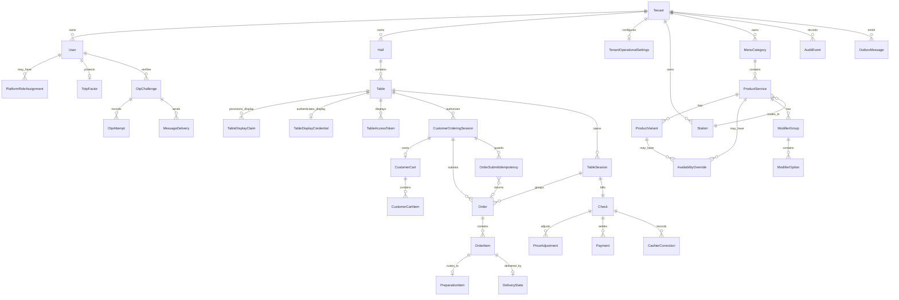

# Data Model

This document defines the initial domain data model for IoTables.

It is not a final database schema. It is the shared domain contract that database migrations, API contracts, and module implementations must follow.

## Principles

- Every tenant-scoped record must carry `tenantId` unless it is globally platform-owned.
- IDs should be opaque UUIDs unless a different identifier is explicitly justified.
- Human-readable names are not trusted identifiers.
- Frontend-provided prices, totals, table session IDs, station IDs, and permission scopes are never authoritative.
- Critical invariants must be enforced in the backend and the database.
- Mutable operational aggregates must define a concurrency strategy before implementation: transaction locks, version checks, or both.
- Runtime records should be soft-disabled or lifecycle-transitioned when history exists; avoid destructive deletion of business history.

## High-Level ERD



## Platform and Tenant

### Tenant

Owned by: Platform / Tenant Registry

| Field | Notes |
| --- | --- |
| `id` | Opaque tenant ID |
| `name` | Required, immutable |
| `subdomain` | Required, immutable, unique |
| `gsmNumber` | Required, editable, audited |
| `sector` | Editable classification; does not re-run starter data |
| `capacity` | Optional, editable |
| `address` | Optional, editable |
| `status` | `provisioning` / `active` / `suspended` / `provisioning_failed` |
| `dnsReady` | Manual DNS setup checklist flag |
| `provisioningError` | Safe error summary when provisioning fails |
| `createdAt`, `updatedAt` | Timestamps |

Invariants:

- `subdomain` is unique.
- `name` and `subdomain` cannot change after creation.
- changing `sector` after creation must not apply starter data again.
- suspended tenants cannot perform runtime operations.
- new tenants start as `provisioning`.
- tenants become `active` only after required setup records commit successfully.
- manual DNS setup is tracked, not automated, in v1.
- capacity is informational in v1 and does not enforce package limits.

### TenantOperationalSettings

Owned by: Tenant Setup

| Field | Notes |
| --- | --- |
| `tenantId` | Tenant |
| `publicDisplayName` | Optional customer-visible name; falls back to immutable tenant name |
| `serviceDeliveryTrackingEnabled` | Enables ServiceStaffApp delivery tracking |
| `createdAt`, `updatedAt` | Timestamps |

Invariants:

- initial `cafe` starter template enables service delivery tracking by default.
- disabling service delivery tracking disables ServiceStaffApp runtime authority.
- when disabled, `PreparationItem.ready` is the final tracked fulfillment state.

### StarterTemplateApplication

Owned by: Sector Starter Templates

| Field | Notes |
| --- | --- |
| `tenantId` | Tenant receiving starter data |
| `sector` | Example: `cafe` |
| `templateVersion` | Versioned starter template |
| `appliedAt` | Completion timestamp |
| `status` | applied / failed / recovery-needed |

Constraints:

- unique by `tenantId + templateVersion`.
- must never run on restart, deployment, migration, or release upgrade.

## Identity, Staff, and Access

### User

Owned by: Identity and Access

| Field | Notes |
| --- | --- |
| `id` | Opaque user ID |
| `tenantId` | Nullable only for platform owner |
| `username` | Unique within tenant or platform scope |
| `status` | active / disabled |
| `firstPasswordChangeRequired` | Bootstrap flag |
| `createdAt`, `updatedAt` | Timestamps |

Starter usernames:

| Role | Username | OTP |
| --- | --- | --- |
| Tenant Admin | tenant subdomain | Required |
| Cashier | `kasiyer` | Required, sent to tenant GSM |
| Cook | `asci` | Not required |
| Barista | `barista` | Not required |
| Waiter | `garson` | Not required |
| Busser | `komi` | Not required |

### Credential

Owned by: Identity and Access

| Field | Notes |
| --- | --- |
| `userId` | User |
| `passwordHash` | Never store plaintext |
| `bootstrapCredential` | True until first password setup |
| `changedAt` | Last password change |

Invariants:

- bootstrap password cannot continue after first login.
- passwords and OTP values must never be logged.

### PlatformRoleAssignment

Owned by: Identity and Access

| Field | Notes |
| --- | --- |
| `userId` | Platform-scoped user |
| `role` | `platform_owner` in v1 |
| `status` | active / disabled |

Invariants:

- only users with `tenantId = null` can hold `platform_owner`.
- v1 allows exactly one active Platform Owner.
- the first Platform Owner is created by explicit bootstrap, not automatic startup seed logic.

### TotpFactor

Owned by: Identity and Access

| Field | Notes |
| --- | --- |
| `userId` | User protected by TOTP |
| `secretCiphertext` | Encrypted TOTP secret |
| `enrolledAt` | Enrollment timestamp |
| `enabled` | Whether factor is required |

Invariants:

- Platform Owner must enroll TOTP before PlatformApp access.
- TOTP secrets must never be logged or exposed after enrollment.

### StaffProfile

Owned by: Staff Access

| Field | Notes |
| --- | --- |
| `tenantId` | Tenant |
| `userId` | Identity user |
| `displayName` | Staff label |
| `status` | active / disabled |

### StaffRoleAssignment

Owned by: Staff Access

| Field | Notes |
| --- | --- |
| `tenantId` | Tenant |
| `userId` | User |
| `role` | tenant_admin / cashier / station_staff / service_staff |

### StaffStationAssignment

Owned by: Staff Access

| Field | Notes |
| --- | --- |
| `tenantId` | Tenant |
| `userId` | Station staff |
| `stationId` | Authorized station |

### StaffHallAssignment

Owned by: Staff Access

| Field | Notes |
| --- | --- |
| `tenantId` | Tenant |
| `userId` | Service staff |
| `hallId` | Authorized hall |

## Venue Layout

### Hall

Owned by: Venue Layout

| Field | Notes |
| --- | --- |
| `tenantId` | Tenant |
| `id` | Hall ID |
| `name` | Human-readable name |
| `displayOrder` | UI order |
| `enabled` | Disabled halls do not accept active use |

### Table

Owned by: Venue Layout

| Field | Notes |
| --- | --- |
| `tenantId` | Tenant |
| `id` | Table ID |
| `hallId` | Parent hall |
| `name` | Human-readable table label |
| `displayOrder` | Ordered grid position inside the hall |
| `enabled` | Disabled tables cannot accept new orders |

Invariants:

- tables belong to exactly one hall.
- tables are managed inside Hall Management in TenantApp.
- v1 tables are ordered within a hall grid; visual floor-plan coordinates are out of scope.
- historical table records should not be hard-deleted when sessions/orders exist.

## Stations and Menu

### Station

Owned by: Tenant Setup / Station Setup; used by Menu Catalog, Staff Access, and Preparation

| Field | Notes |
| --- | --- |
| `tenantId` | Tenant |
| `id` | Station ID |
| `name` | Example: Mutfak, Kahve |
| `displayOrder` | TenantApp and staff UI order |
| `enabled` | Disabled stations cannot receive new items |

### MenuCategory

Owned by: Menu Catalog

| Field | Notes |
| --- | --- |
| `tenantId` | Tenant |
| `id` | Category ID |
| `name` | Customer-visible category |
| `displayOrder` | UI order |
| `enabled` | Controls visibility/orderability |

### ProductService

Owned by: Menu Catalog

| Field | Notes |
| --- | --- |
| `tenantId` | Tenant |
| `id` | Product/service ID |
| `categoryId` | Menu category |
| `stationId` | Fulfillment station |
| `name` | Customer-visible name |
| `description` | Optional |
| `imageRef` | Optional |
| `enabled` | Historical disable flag |

Invariants:

- disabled products cannot be ordered.
- every orderable product/service has at least one enabled ProductVariant.
- availability is rechecked during order submission.
- v1 routes each product/service to exactly one station.
- multi-station routing for one product/service is out of v1.

### ProductVariant

Owned by: Menu Catalog

| Field | Notes |
| --- | --- |
| `tenantId` | Tenant |
| `productServiceId` | Parent product/service |
| `id` | Variant ID |
| `name` | Example: Small, Large, Single Portion |
| `price` | Current price authority |
| `displayOrder` | UI order |
| `isDefault` | Default variant for simple products |
| `enabled` | Historical disable flag |

Invariants:

- simple single-price products still use one default ProductVariant.
- current variant price changes do not alter existing OrderItem snapshots.
- disabled variants cannot be ordered.
- at most one default variant exists per product/service.
- at least one enabled variant is required for a product/service to be orderable.

### AvailabilityOverride

Owned by: Menu Catalog

| Field | Notes |
| --- | --- |
| `tenantId` | Tenant |
| `productServiceId` | Target product/service |
| `productVariantId` | Optional target variant |
| `state` | available / unavailable |
| `reason` | Optional staff-visible reason |
| `startsAt`, `expiresAt` | Optional validity window |
| `createdByUserId` | Tenant Admin actor |

Invariants:

- temporary sold-out must use AvailabilityOverride instead of disabling the historical product or variant.
- variant-level override affects only that variant.
- product-level unavailable override blocks all variants unless a more specific future rule is introduced.
- expired overrides must not affect order submission.

### ModifierGroup

Owned by: Menu Catalog

| Field | Notes |
| --- | --- |
| `productServiceId` | Parent product |
| `name` | Example: Size, Milk Type |
| `required` | Whether customer must select |
| `minSelections`, `maxSelections` | Selection constraints |

### ModifierOption

Owned by: Menu Catalog

| Field | Notes |
| --- | --- |
| `modifierGroupId` | Parent group |
| `name` | Customer-visible option |
| `priceDelta` | Price effect |
| `available` | Orderability |

## Table Access and Customer Session

### TableDisplayClaim

Owned by: Tenant Setup / Table Display Provisioning

| Field | Notes |
| --- | --- |
| `tenantId` | Tenant |
| `tableId` | Table being provisioned |
| `claimHash` | Store hash, not raw claim |
| `createdByUserId` | Tenant Admin actor |
| `expiresAt` | Short lifetime |
| `consumedAt` | Set atomically |

Invariants:

- claim is one-time use.
- claim consumption creates or rotates the active TableDisplayCredential.
- expired or consumed claims must fail closed.

### TableDisplayCredential

Owned by: Tenant Setup / Table Display Provisioning

| Field | Notes |
| --- | --- |
| `tenantId` | Tenant |
| `tableId` | Table |
| `credentialHash` | Store hash, not raw credential |
| `status` | active / revoked |
| `provisionedAt`, `revokedAt` | Lifecycle timestamps |
| `lastSeenAt` | Last successful QR fetch |

Invariants:

- only one active display credential exists per tenant/table in v1.
- credential is used only by the ESP32 table display to fetch QR payloads.
- backend resolves table context from the credential, not from client-provided table IDs.
- re-provisioning revokes the previous active credential.

### TableAccessToken

Owned by: Ordering / Table Presence

| Field | Notes |
| --- | --- |
| `tenantId` | Tenant |
| `tableId` | Table |
| `tokenHash` | Store hash, not raw token |
| `expiresAt` | 60 seconds in v1 |
| `consumedAt` | Set atomically |

Invariants:

- token is one-time use.
- token redemption is atomic.
- token must not expose trusted table IDs directly.

### CustomerOrderingSession

Owned by: Customer Ordering

| Field | Notes |
| --- | --- |
| `tenantId` | Tenant |
| `id` | Session ID |
| `tableId` | Table context |
| `tableSessionId` | Current joined TableSession, nullable |
| `cookieTokenHash` | Opaque browser session token hash |
| `presenceValidUntil` | Fresh table presence window |
| `expiresAt` | 30 minutes in v1 |
| `lastSeenAt` | Activity |

Invariants:

- not created per order.
- may contain multiple orders.
- fresh QR refreshes existing compatible session when possible.
- cart belongs here, not to TableSession.

### CustomerCart

Owned by: Customer Ordering

| Field | Notes |
| --- | --- |
| `tenantId` | Tenant |
| `customerOrderingSessionId` | Cart owner |
| `status` | active / submitted / abandoned |
| `createdAt`, `updatedAt` | Timestamps |

Invariants:

- cart is not billable.
- one active cart exists per CustomerOrderingSession in v1.
- successful order submission clears or closes only the submitted cart.
- failed order submission preserves the cart for correction or retry.

### CustomerCartItem

Owned by: Customer Ordering

| Field | Notes |
| --- | --- |
| `cartId` | Cart owner |
| `clientCartItemId` | Client-generated stable item ID |
| `productServiceId` | Product |
| `productVariantId` | Selected product variant |
| `quantity` | Quantity |
| `selectedModifiers` | Modifier option selections |
| `note` | Customer note |
| `estimatedPrice` | Client-visible only, not trusted |

## Orders, Preparation, and Delivery

### TableSession

Owned by: Table Session and Billing

| Field | Notes |
| --- | --- |
| `tenantId` | Tenant |
| `id` | Session ID |
| `tableId` | Table |
| `status` | open / closed |
| `openedAt`, `closedAt` | Lifecycle timestamps |

Constraints:

- only one active TableSession per `tenantId + tableId`.
- closed sessions cannot accept new orders/payments except explicit recovery.

### Order

Owned by: Customer Ordering

| Field | Notes |
| --- | --- |
| `tenantId` | Tenant |
| `id` | Order ID |
| `customerOrderingSessionId` | My Orders ownership |
| `tableSessionId` | Table bill/session ownership |
| `submittedAt` | Order time |
| `status` | Submitted/operational aggregate status if needed |
| `orderChannel` | `dine_in_qr` in v1 |

Invariants:

- v1 creates only `dine_in_qr` orders.
- waiter-entered, pickup, delivery, package, marketplace, phone, and counter-sale channels are out of v1.

### OrderSubmitIdempotency

Owned by: Customer Ordering

| Field | Notes |
| --- | --- |
| `tenantId` | Tenant |
| `customerOrderingSessionId` | Session that submitted |
| `idempotencyKey` | Request key |
| `requestHash` | Optional normalized request fingerprint |
| `orderId` | Created order, nullable while processing |
| `status` | processing / completed / failed |
| `createdAt`, `completedAt` | Timestamps |

Invariants:

- unique by `tenantId + customerOrderingSessionId + idempotencyKey`.
- duplicate submit with the same key returns the original order result.
- same key with a materially different request must fail closed.

### OrderItem

Owned by: Customer Ordering

| Field | Notes |
| --- | --- |
| `tenantId` | Tenant |
| `id` | Order item ID |
| `orderId` | Parent order |
| `productServiceId` | Source product |
| `productVariantId` | Source variant |
| `stationId` | Routing snapshot |
| `nameSnapshot` | Product name at order time |
| `variantNameSnapshot` | Variant name at order time |
| `unitPriceSnapshot` | Server-calculated price |
| `modifierSnapshot` | Selected modifiers and price deltas |
| `quantity` | Quantity |
| `note` | Customer note |
| `voidedAt` | Nullable cashier correction timestamp |
| `voidedByUserId` | Nullable cashier actor |
| `voidReason` | Required when voided |

Invariants:

- price snapshots are created server-side at submission time.
- direct snapshot edits are not allowed.
- existing order item snapshots do not change when variants are renamed, disabled, or repriced.
- v1 cashier item void is allowed only while preparation status is `pending` or `cannot_prepare` and before any payment is recorded for the Check.

### PreparationItem

Owned by: Preparation

| Field | Notes |
| --- | --- |
| `tenantId` | Tenant |
| `orderItemId` | Routed order item |
| `stationId` | Station queue |
| `status` | pending / preparing / ready / cannot_prepare |
| `cannotPrepareReason` | Required when status is `cannot_prepare` |
| `updatedBy`, `updatedAt` | Last transition |

Valid v1 transitions:

```text
pending -> preparing -> ready
pending -> cannot_prepare
preparing -> cannot_prepare
```

Invariants:

- `cannot_prepare` is an operational exception, not a financial correction.
- `cannot_prepare` does not cancel, discount, refund, remove, or reprice an OrderItem.
- CashierApp must handle account/customer correction through allowed cashier workflows.

### DeliveryState

Owned by: Service Delivery

| Field | Notes |
| --- | --- |
| `tenantId` | Tenant |
| `orderItemId` | Delivered order item |
| `status` | picked_up / delivered |
| `updatedBy`, `updatedAt` | Last transition |

Customer mapping:

When service delivery tracking is enabled:

| Internal State | Customer Text |
| --- | --- |
| PreparationItem.pending / PreparationItem.preparing / PreparationItem.ready / DeliveryState.picked_up | Hazırlanıyor |
| DeliveryState.delivered | Teslim edildi |

When service delivery tracking is disabled:

| Internal State | Customer Text |
| --- | --- |
| PreparationItem.pending / PreparationItem.preparing | Hazırlanıyor |
| PreparationItem.ready | Teslim edildi |

## Payments and Billing

### Check

Owned by: Table Session and Billing

| Field | Notes |
| --- | --- |
| `tenantId` | Tenant |
| `id` | Check/Adisyon ID |
| `tableSessionId` | Parent TableSession |
| `status` | open / closed |
| `openedAt`, `closedAt` | Lifecycle timestamps |

Invariants:

- v1 has exactly one Check per TableSession.
- split checks, merged checks, item/person-based split payment, and moving items between checks are out of v1.
- Check total is calculated server-side from OrderItem snapshots, void/correction records, and PriceAdjustment records.
- CustomerApp can read Check summary with fresh table presence but cannot mutate it.
- CashierApp closes a TableSession through the Check settlement workflow.

### PriceAdjustment

Owned by: Table Session and Billing

| Field | Notes |
| --- | --- |
| `tenantId` | Tenant |
| `id` | Adjustment ID |
| `checkId` | Check/Adisyon being adjusted |
| `orderItemId` | Nullable affected order item |
| `type` | tax / discount / service_charge / campaign / correction |
| `amount` | Signed amount |
| `reason` | Required for correction |
| `createdByUserId` | Actor or system |
| `createdAt` | Timestamp |

V1 rules:

- menu prices are VAT/tax-inclusive operational prices.
- separate tax calculation, manual discounts, service fees, campaigns, and customer price confirmation are out of v1.
- `PriceAdjustment` exists to keep future pricing structure explicit, not to expose broad cashier discount power.
- V1 item void is represented by `OrderItem` void fields plus `CashierCorrection`, not by a separate negative price adjustment.

### Payment

Owned by: Payments

| Field | Notes |
| --- | --- |
| `tenantId` | Tenant |
| `id` | Payment ID |
| `checkId` | Settled Check/Adisyon |
| `amount` | Positive amount |
| `method` | cash / card / transfer |
| `status` | recorded / voided |
| `cashierUserId` | Actor |
| `receivedAt` | Timestamp |
| `voidedAt`, `voidedByUserId`, `voidReason` | Nullable void fields |

Invariants:

- payment creation is idempotent.
- CustomerApp is read-only for bill/payment data.
- remaining balance is calculated server-side.
- v1 payment void is allowed only on an open Check when no external payment provider is involved.
- external payment providers and customer payment flows are out of v1.
- overpayment is out of v1; payment amount cannot exceed the current remaining balance.

### PaymentIdempotency

Owned by: Payments

| Field | Notes |
| --- | --- |
| `tenantId` | Tenant |
| `checkId` | Check/Adisyon |
| `idempotencyKey` | Request key |
| `paymentId` | Created payment |

### CashierCorrection

Owned by: Table Session and Billing

| Field | Notes |
| --- | --- |
| `tenantId` | Tenant |
| `id` | Correction ID |
| `checkId` | Affected Check/Adisyon |
| `type` | note / item_void / payment_void |
| `targetType`, `targetId` | Affected entity |
| `reason` | Required |
| `createdByUserId` | Cashier actor |
| `createdAt` | Timestamp |

V1 rules:

- note-only correction is allowed.
- item void is allowed only while preparation state is `pending` or `cannot_prepare` and before any payment is recorded.
- payment void is allowed only on an open Check and only for non-provider payments.
- manual items, manual discounts, service fees, refunds after closure, direct price snapshot edits, and moving items between checks/sessions are out of v1.

## OTP, Audit, and Side Effects

### OtpChallenge

Owned by: OTP / Messaging

| Field | Notes |
| --- | --- |
| `tenantId` | Tenant |
| `id` | Challenge ID |
| `userId` | User being verified |
| `purpose` | tenant_admin_first_password / cashier_first_password |
| `targetGsm` | Tenant GSM in v1 for tenant admin/cashier bootstrap |
| `codeHash` | Never plaintext |
| `expiresAt` | Short lifetime |
| `verifiedAt` | Completion |

Invariants:

- OTP values are stored hashed or otherwise non-recoverable.
- V1 OTP lifetime is 5 minutes.
- V1 allows at most 5 verification attempts per challenge.
- V1 allows at most 3 send attempts per challenge with cooldown between sends.
- OTP verification is idempotent after success.

### OtpAttempt

Owned by: OTP / Messaging

| Field | Notes |
| --- | --- |
| `tenantId` | Tenant |
| `otpChallengeId` | Challenge being attempted |
| `attemptNo` | Monotonic attempt number |
| `result` | success / failed / locked / expired |
| `createdAt` | Attempt timestamp |

### MessageDelivery

Owned by: OTP / Messaging

| Field | Notes |
| --- | --- |
| `tenantId` | Tenant |
| `otpChallengeId` | Challenge being delivered |
| `deliveryNo` | Monotonic send attempt number |
| `provider` | SMS provider adapter name |
| `providerMessageRef` | Nullable provider message reference |
| `status` | queued / sent / failed |
| `errorSummary` | Redacted provider error summary |
| `createdAt`, `completedAt` | Attempt timestamps |

Invariants:

- Provider responses must be recorded without OTP codes, provider secrets, or sensitive raw payloads.
- Delivery failure does not rollback the source identity/password setup transaction automatically.
- A new delivery attempt must use the current target GSM at challenge creation time; existing challenges must not silently retarget.

### AuditEvent

Owned by: Audit

| Field | Notes |
| --- | --- |
| `tenantId` | Nullable for platform-global actions |
| `id` | Audit event ID |
| `actorUserId` | Nullable for system actor |
| `action` | Structured action name |
| `targetType`, `targetId` | Changed target |
| `reason` | Required for corrections/destructive actions |
| `metadata` | Structured, no secrets |
| `createdAt` | Timestamp |

### OutboxMessage

Owned by: Reliable Side Effects

| Field | Notes |
| --- | --- |
| `tenantId` | Nullable for platform-global effects |
| `id` | Outbox message ID |
| `effectType` | sms / printer / fiscal / payment_provider / dns / notification / device |
| `aggregateType`, `aggregateId` | Source business decision |
| `payloadRef` | Structured payload reference or redacted payload |
| `idempotencyRef` | Stable duplicate-protection reference |
| `status` | pending / claimed / completed / failed |
| `nextAttemptAt` | Retry scheduling |
| `createdAt`, `completedAt` | Lifecycle timestamps |

### ExternalEffectAttempt

Owned by: Reliable Side Effects

| Field | Notes |
| --- | --- |
| `outboxMessageId` | Parent outbox message |
| `attemptNo` | Monotonic attempt number |
| `startedAt`, `completedAt` | Attempt timestamps |
| `result` | success / retryable_failure / permanent_failure / timeout |
| `resultSummary` | Redacted provider response summary |

Minimum v1 action names:

| Action | Scope |
| --- | --- |
| `platform_owner.created` | Platform |
| `platform_owner.totp_enrolled` | Platform |
| `tenant.created` | Platform |
| `tenant.provisioning_failed` | Platform |
| `tenant.activated` | Platform |
| `tenant.suspended` | Platform |
| `tenant.gsm_changed` | Platform/Tenant |
| `starter_template.applied` | Platform |
| `user.created` | Access |
| `user.disabled` | Access |
| `password.changed` | Access |
| `otp.verified` | Access |
| `table_display.provisioned` | Tenant Setup |
| `table_display.revoked` | Tenant Setup |
| `order.submitted` | Ordering |
| `preparation.status_changed` | Fulfillment |
| `delivery.status_changed` | Fulfillment |
| `payment.recorded` | Settlement |
| `payment.voided` | Settlement |
| `session.closed` | Settlement |
| `cashier.correction_applied` | Settlement |

## Required Database Constraints

| Constraint | Purpose |
| --- | --- |
| unique `Tenant.subdomain` | Prevent duplicate tenant domain |
| immutable tenant name/subdomain by service rule | Preserve tenant identity |
| unique active Platform Owner | Preserve single-user PlatformApp scope in v1 |
| Tenant status enum check | Preserve exact v1 lifecycle |
| unique TableDisplayClaim hash | Prevent provisioning claim collision/replay ambiguity |
| unique active TableDisplayCredential per tenant/table | Prevent multiple active display credentials |
| unique active TableSession per tenant/table | Prevent double active table sessions |
| unique Check per TableSession in v1 | Preserve single-adisyon v1 model |
| unique starter template application per tenant/template version | Prevent seed reruns |
| unique active CustomerCart per customer ordering session | Prevent parallel carts in v1 |
| unique order submit idempotency key per tenant/customer session/key | Prevent duplicate orders |
| unique payment idempotency key per tenant/check/key | Prevent duplicate payments |
| unique outbox idempotency reference per effect type | Prevent duplicate external side effects |
| unique default ProductVariant per tenant/product | Prevent multiple default orderable variants |
| orderable ProductService requires at least one enabled ProductVariant | Prevent products without an orderable unit from entering customer ordering |
| ProductService.stationId foreign key to Station | Preserve v1 single-station routing integrity |
| foreign key CustomerCartItem.productVariantId to ProductVariant | Preserve cart variant integrity |
| foreign key OrderItem.productVariantId to ProductVariant | Preserve order variant history source |
| check positive ProductVariant price | Prevent invalid current menu prices |
| check AvailabilityOverride target consistency | Require product-level or product+variant-level target |
| OtpAttempt attempt number unique per challenge | Preserve retry/rate-limit accounting |
| MessageDelivery delivery number unique per challenge | Preserve SMS send attempt accounting |
| foreign keys for tenant-owned records | Preserve tenant data integrity |
| check positive payment amount | Prevent invalid payments |
| check positive order item quantity | Prevent invalid orders |

## Transaction Boundaries

### Tenant Creation

One tenant creation flow includes:

- Tenant,
- tenant admin user,
- starter staff users if sector template selected,
- starter halls/tables/stations/menu,
- starter template application record,
- audit event.

Failure must rollback or mark provisioning as failed for manual recovery. Starter data must not re-run after successful application.

### Order Submission

One order submission transaction includes:

- OrderSubmitIdempotency reservation,
- active CustomerCart validation,
- active TableSession select/create,
- CustomerOrderingSession join,
- Order,
- OrderItems,
- product/variant/price/modifier snapshots,
- PreparationItems,
- single Check creation when a new TableSession is opened,
- submitted CustomerCart close/clear.

Failure must not expose partial orders to CustomerApp, CashierApp, StationStaffApp, or ServiceStaffApp.

### Payment

One payment transaction includes:

- Payment,
- payment idempotency record,
- billing read model update if materialized,
- audit event.

Failure must not double-count paid amount.

### External Side Effect

One external side-effect workflow includes:

- committed source business decision,
- OutboxMessage with stable idempotency reference,
- one or more ExternalEffectAttempt records,
- completed or failed terminal state.

Failure must not pretend the side effect rolled back with the source transaction. Retry and recovery must be explicit.

### Cashier Correction

One cashier correction transaction includes:

- correction authorization check,
- target state validation,
- CashierCorrection,
- affected OrderItem, Payment, or PriceAdjustment record,
- billing read model update if materialized,
- audit event.

Failure must not partially mutate billable records.

## Open Questions

None currently.
